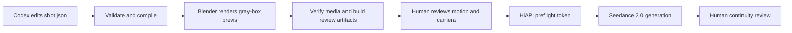

# Awesome Codex + Blender + Seedance Workflows

[简体中文](README.zh-CN.md) | [Setup](docs/setup.md) | [Architecture](docs/architecture.md) | [Research](docs/research.md) | [Roadmap](docs/PLAN.md)

Executable, reviewable workflows for turning a Codex-authored shot plan into a Blender gray-box previs and then into a Seedance 2.0 video through [HiAPI](https://www.hiapi.ai/).

This is not another prompt gallery. Every included workflow has a versioned JSON shot contract, deterministic compilation, a real Blender batch render, a dry-run-first HiAPI request, and tests.



## What ships

| Workflow | Control problem | Duration | Camera |
|---|---|---:|---|
| [Warehouse Pursuit](examples/warehouse-pursuit/shot.json) | Chase spacing, crossing obstacle, visible handheld sway | 6s | Low handheld follow |
| [Rooftop Signal Reveal](examples/rooftop-reveal/shot.json) | Performance-to-scale reveal across three skyline depths | 8s | Medium follow to crane wide |
| [Precision Watch Reveal](examples/tabletop-reveal/shot.json) | Product geometry, second-hand start, and highlight timing | 5s | Macro slider arc |

The engine supports white-listed cubes, spheres, cylinders, cones, object transforms, camera transforms, focal-length changes, and linear keyframes. It deliberately does not execute arbitrary model-authored Python.

## Quick start

Requirements: Node.js 20+, Blender 4.5+, and FFmpeg with `ffprobe` and `libx264`. This repository was verified on Windows with Node 22.22.3, Blender 5.2.0 LTS, and FFmpeg 8.1.2.

```powershell
npm ci
npm run doctor -- --strict
npm test
npm run compile -- examples/warehouse-pursuit/shot.json --out-dir outputs/warehouse-pursuit
npm run render -- examples/warehouse-pursuit/shot.json --out-dir outputs/warehouse-pursuit
```

Inspect `outputs/warehouse-pursuit/prompt.txt`, `manifest.json`, and `seedance.request.json`, then open `outputs/warehouse-pursuit/review/contact-sheet.png`, follow `outputs/warehouse-pursuit/review-checklist.md`, and watch `outputs/warehouse-pursuit/previs.mp4` from beginning to end. The proxies need to communicate the intended screen direction, timing, spacing, and camera path; they are not a visual target.

Add `--blocking-svg` to the render command when a top-down object/camera-path diagram would help review spatial choreography.

Dry-run the Seedance package from that same canonical output directory:

```powershell
npm run generate -- --request outputs/warehouse-pursuit/seedance.request.json --video outputs/warehouse-pursuit/previs.mp4 --out-dir outputs/warehouse-pursuit/hiapi
```

The last command is a dry run. It prints the full API endpoint, a payload summary, and a SHA-256 `preflightToken`, but it does not read the API key or create a task. The token binds the endpoint, request, and video. Before a paid request, watch the complete previs, finish `review-checklist.md`, resolve every automatic flag, and change `humanReviewComplete` from `false` to `true` in the matching `review-report.json`. The paid command rejects a report whose request hash or video SHA-256 does not match. It then requires the exact token from the current dry run:

```powershell
npm run generate -- --request outputs/warehouse-pursuit/seedance.request.json --video outputs/warehouse-pursuit/previs.mp4 --out-dir outputs/warehouse-pursuit/hiapi --confirm-preflight <token>
```

The paid POST sends that token as `Idempotency-Key` and canonical JSON bytes. Before the request leaves the machine, the CLI writes `hiapi/preflight-<token>.pending.json` with an immutable first-attempt time and a salted one-way binding to the exact API key; it never stores the key. After it receives a valid task ID, it writes `<task-id>.submitted.json` and removes the pending journal. If the connection is lost during submission, keep the journal and retry only with the same key, unchanged inputs, and token, and only inside the journal's 23-hour safe window. A definitive client rejection clears pending state, while ambiguous status codes and transport failures keep it for reconciliation. Once the window expires, the CLI refuses to resubmit because server idempotency may have expired. Local reference videos are capped at 90 MiB so base64 stays below the API request-body limit. Completed MP4 downloads resolve and validate every address per redirect, pin that address set without re-resolving, fall back across reachable addresses inside one deadline, stream to a temporary file, enforce response/type/size/container bounds, publish with atomic no-clobber semantics, and record `<task-id>.download.json` with bytes and SHA-256.

[Create a HiAPI account](https://www.hiapi.ai/en/register), then create and manage an API key in the [HiAPI dashboard](https://www.hiapi.ai/en/dashboard/api-keys). Put it in the process environment as `HIAPI_API_KEY`; never put it in chat, source, a command argument, or Git. See [setup](docs/setup.md) for safe per-session examples.

## Use with Codex

Open this repository in Codex and give it a constrained shot brief:

```text
Read AGENTS.md. Copy the closest example into examples/subway-platform-reveal.
Create one continuous 7-second shot: a commuter notices an empty train arriving,
then the camera dollies sideways to reveal every carriage is dark. Keep screen
direction stable, use no more than six proxies, validate, compile, and render the
previs. Do not submit a paid HiAPI task.
```

`AGENTS.md` makes the review gates explicit. Blender MCP or [Blockout](https://github.com/wassermanproductions/blockout) can still be used for interactive exploration, but the final contribution must reduce to `shot.json` so it remains diffable and reproducible.

## Generated package

```text
outputs/<shot-id>/
|-- compiled.json
|-- manifest.json
|-- prompt.txt
|-- seedance.request.json
|-- previs.blend
|-- previs.mp4
|-- render-report.json
|-- review-report.json
|-- review-checklist.md
|-- frames/
|   `-- frame_####.png
|-- review/
|   |-- first-frame.png
|   |-- middle-frame.png
|   |-- last-frame.png
|   |-- contact-sheet.png
|   `-- blocking-top.svg  # only with --blocking-svg
`-- hiapi/                # only after a confirmed task
```

The compiler and renderer claim an empty output directory with a shot-specific marker and hold an exclusive lock while writing; they refuse non-empty unowned directories, concurrent writers, and reuse by another shot. A render is built and verified in an isolated staging directory, so Blender, encoding, or review failure leaves the previous published render intact. Promotion uses a recoverable backup transaction, and a later run repairs an interrupted promotion before starting. The renderer requires an exact contiguous PNG sequence, encodes to a temporary MP4, and uses FFprobe to verify H.264/yuv420p, dimensions, frame rate, and frame count before publication. `review-report.json` records the verified media facts plus automatic blank-frame and abrupt-luma-change flags. Those flags are triage aids, not a creative pass. Generated media, reports, task journals, staging data, and `.blend` files are ignored by Git even under a custom output directory; the manifest stores content hashes without embedding API keys or machine-specific paths.

## Design decisions

- **Previs is a control signal.** The compiled prompt tells Seedance to preserve blocking, timing, lens rhythm, and camera path while replacing every proxy surface.
- **One shot per spec.** Seedance references are strongest when a 4-15 second clip has one spatial and temporal contract.
- **No hidden paid action.** Submission is dry-run first; the confirmation token changes if the endpoint, request, or local video changes.
- **Recoverable paid handoff.** The preflight token is also the server idempotency key, and a local pending journal exists before the POST.
- **No arbitrary Blender code.** Schema validation and white-listed primitives keep Codex output auditable.
- **Interactive tools remain optional.** Blender MCP and Blockout are excellent authoring surfaces; this project is the lightweight, Git-native handoff layer.

## Human review checklist

Before paid generation: inspect the generated stills and contact sheet, resolve every automatic flag in `review-report.json`, then watch the whole previs and complete `review-checklist.md`. Confirm performer spacing, screen direction, contacts, camera speed, and requested duration. Do not change `humanReviewComplete` until a person has watched the complete video.

After generation: review the whole clip for subject identity, limb/contact integrity, camera adherence, object count, continuity locks, unwanted proxy leakage, unsafe likeness/IP use, and audio sync. API `success` means generation completed; it does not mean the shot passed creative QC.

## Contributing

Start with [CONTRIBUTING.md](CONTRIBUTING.md). A workflow PR must include an original shot spec, a passing offline test run, a reviewed Blender previs, clear rights for any optional references, and no generated binaries or credentials.

MIT licensed. Research sources and non-code inspirations are recorded in [docs/research.md](docs/research.md); no third-party code or media is bundled.
