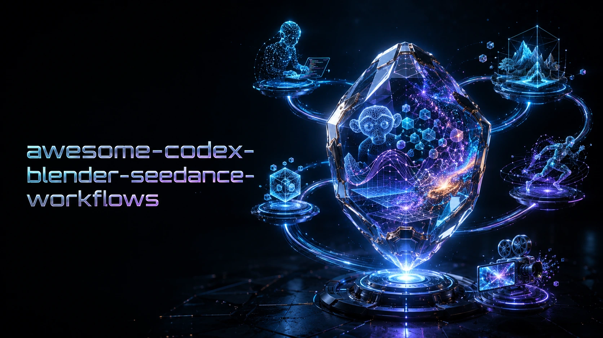
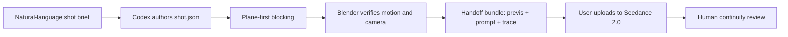

# Awesome Codex + Blender + Seedance Workflows

[](https://www.hiapi.ai/)

[简体中文](README.zh-CN.md) | [Setup](docs/setup.md) | [Architecture](docs/architecture.md) | [Research](docs/research.md) | [Roadmap](docs/PLAN.md)

Executable, reviewable workflows for turning a natural-language shot brief into a Blender gray-box previs and a complete manual Seedance 2.0 handoff bundle.

This is not another prompt gallery. Codex translates the brief into a versioned JSON shot contract, Blender verifies the blocking and camera, and the renderer packages the motion reference, generated prompt, review stills, and trace for the user to upload to Seedance.



## What ships

| Workflow | Control problem | Duration | Camera |
|---|---|---:|---|
| [Warehouse Pursuit](examples/warehouse-pursuit/shot.json) | Chase spacing, crossing obstacle, visible handheld sway | 6s | Low handheld follow |
| [Rooftop Signal Reveal](examples/rooftop-reveal/shot.json) | Performance-to-scale reveal across three skyline depths | 8s | Medium follow to crane wide |
| [Precision Watch Reveal](examples/tabletop-reveal/shot.json) | Product geometry, second-hand start, and highlight timing | 5s | Macro slider arc |
| [Desert RV Laboratory](examples/desert-rv-laboratory/shot.json) | Warm/cold interior contrast, glass and metal response, subtle performance | 8s | 35mm slow dolly-in |

The engine supports white-listed cubes, spheres, cylinders, cones, object transforms, camera transforms, focal-length changes, and linear keyframes. Optional cinematic specs can select bounded Cycles samples, material presets, bevels, smooth shading, depth of field, volumetric density, and up to 16 validated lights. It deliberately does not execute arbitrary model-authored Python.

## Authoring method

Adapted from [Reid Hannaford's Blender-to-Seedance process](https://x.com/reidhannaford/status/2071595581508563168): lock the first-frame composition with a precise frame brief or reviewed 2D frame, establish the ground plane and screen direction, then use Blender to solve only blocking, timing, occlusion, and camera motion. Seedance supplies production appearance; the previs is not a modeling portfolio.

| Build in Blender | Skip unless it changes the shot |
|---|---|
| Silhouette and approximate volume | Final topology and subdivision |
| Relative scale and ground contact | Faces, fingers, and costume detail |
| Paths, spacing, overlap, and occlusion | Micro-textures and hidden surfaces |
| Camera height, lens, target, and horizon | Decorative geometry outside frame |
| Distinct action and camera beats | Extra keyframes between clear beats |

Match frame 1 to the approved frame brief, animate with the fewest readable keys, and change only one class of variable per iteration: blocking, timing, or camera. Review the complete MP4 and use `motion-trace.json` for exact evaluated transforms. A 2D start frame is optional authoring evidence, not a prerequisite or an automatically submitted input.

## Quick start

Requirements: Node.js 20+, Blender 4.5+, and FFmpeg with `ffprobe` and `libx264`. This repository was verified on Windows with Node 22.22.3, Blender 5.2.0 LTS, and FFmpeg 8.1.2.

```powershell
npm ci
npm run doctor -- --strict
npm test
npm run compile -- examples/warehouse-pursuit/shot.json --out-dir outputs/warehouse-pursuit
npm run render -- examples/warehouse-pursuit/shot.json --out-dir outputs/warehouse-pursuit
```

Inspect `outputs/warehouse-pursuit/prompt.txt` and `seedance-handoff.md`, then open `outputs/warehouse-pursuit/review/contact-sheet.png`, follow `outputs/warehouse-pursuit/review-checklist.md`, and watch `outputs/warehouse-pursuit/previs.mp4` from beginning to end. The proxies need to communicate the intended screen direction, timing, spacing, and camera path; they are not a visual target.

Add `--blocking-svg` to the render command when a top-down object/camera-path diagram would help review spatial choreography.

The default handoff is manual: upload `previs.mp4` as the primary motion reference and paste `prompt.txt` into Seedance 2.0. `seedance-handoff.md` records the exact upload order and settings; `handoff-manifest.json` binds the file roles, byte counts, hashes, and evaluated camera summary.

## Optional API submission

Only use API submission when the user explicitly requests it and the active provider has been verified to forward reference video inputs end to end. Start with a free dry run:

```powershell
npm run generate -- --request outputs/warehouse-pursuit/seedance.request.json --video outputs/warehouse-pursuit/previs.mp4 --out-dir outputs/warehouse-pursuit/hiapi
```

The command prints a SHA-256 `preflightToken` but does not create a task. A paid request requires completed human review and the exact current token:

```powershell
npm run generate -- --request outputs/warehouse-pursuit/seedance.request.json --video outputs/warehouse-pursuit/previs.mp4 --out-dir outputs/warehouse-pursuit/hiapi --confirm-preflight <token>
```

The token also acts as the idempotency key. Ambiguous submission failures keep a local journal for same-input recovery; validated downloads are published atomically. See [architecture](docs/architecture.md) for the complete trust boundary and [setup](docs/setup.md) for credential handling.

## Use with Codex

Open this repository in Codex and give it a natural-language shot brief; Codex writes the structured spec:

```text
Use $awesome-codex-blender-seedance-workflows and read AGENTS.md.
Copy the closest example into examples/subway-platform-reveal.
Create one continuous 7-second shot: a commuter notices an empty train arriving,
then the camera dollies sideways to reveal every carriage is dark. Keep screen
direction stable, use no more than six proxies, validate, compile, and render the
previs and manual Seedance handoff bundle. Do not submit a paid API task.
```

`AGENTS.md` makes the review gates explicit. Blender MCP or [Blockout](https://github.com/wassermanproductions/blockout) can still be used for interactive exploration, but the final contribution must reduce to `shot.json` so it remains diffable and reproducible.

## Generated package

```text
outputs/<shot-id>/
|-- compiled.json
|-- manifest.json
|-- prompt.txt
|-- seedance.request.json
|-- previs.blend
|-- motion-trace.json
|-- previs.mp4
|-- render-report.json
|-- review-report.json
|-- review-checklist.md
|-- handoff-manifest.json
|-- seedance-handoff.md
|-- frames/
|   `-- frame_####.png
|-- review/
|   |-- first-frame.png
|   |-- middle-frame.png
|   |-- last-frame.png
|   |-- contact-sheet.png
|   `-- blocking-top.svg  # only with --blocking-svg
`-- hiapi/                # optional, only after a confirmed API task
```

The compiler and renderer claim an empty output directory with a shot-specific marker and hold an exclusive lock while writing; they refuse non-empty unowned directories, concurrent writers, and reuse by another shot. A render is built and verified in an isolated staging directory, so Blender, encoding, or review failure leaves the previous published render intact. Promotion uses a recoverable backup transaction, and a later run repairs an interrupted promotion before starting. Blender writes `motion-trace.json` from its evaluated dependency graph: every rendered frame records the actual camera location, target, forward/up vectors, focal length, horizontal field of view, and each proxy transform after interpolation and constraints. The Node wrapper rejects missing frames, timeline drift, malformed vectors, or object-set drift before publication. The renderer requires an exact contiguous PNG sequence, encodes to a temporary MP4, and uses FFprobe to verify H.264/yuv420p, dimensions, frame rate, and frame count before publication. `review-report.json` records the verified media facts plus automatic blank-frame and abrupt-luma-change flags. Those flags are triage aids, not a creative pass. Generated media, reports, task journals, staging data, and `.blend` files are ignored by Git even under a custom output directory; the manifest stores content hashes without embedding API keys or machine-specific paths.

## Design decisions

- **Previs is a control signal.** The compiled prompt tells Seedance to preserve blocking, timing, lens rhythm, and camera path while replacing every proxy surface.
- **One shot per spec.** Seedance references are strongest when a 4-15 second clip has one spatial and temporal contract.
- **Manual handoff is the default.** Every verified render includes the video, prompt, review artifacts, hashes, camera facts, and upload instructions.
- **No hidden paid action.** Optional API submission remains dry-run first and requires provider capability verification.
- **No arbitrary Blender code.** Schema validation and white-listed primitives keep Codex output auditable.
- **Interactive tools remain optional.** Blender MCP and Blockout are excellent authoring surfaces; this project is the lightweight, Git-native handoff layer.

## Human review checklist

Before handoff: inspect the generated stills and contact sheet, resolve every automatic flag in `review-report.json`, then watch the whole previs and complete `review-checklist.md`. Confirm performer spacing, screen direction, contacts, camera speed, and requested duration. Do not change `humanReviewComplete` until a person has watched the complete video.

After generation: review the whole clip for subject identity, limb/contact integrity, camera adherence, object count, continuity locks, unwanted proxy leakage, unsafe likeness/IP use, and audio sync. API `success` means generation completed; it does not mean the shot passed creative QC.

## Contributing

Start with [CONTRIBUTING.md](CONTRIBUTING.md). A workflow PR must include an original shot spec, a passing offline test run, a reviewed Blender previs, clear rights for any optional references, and no generated binaries or credentials.

MIT licensed. Research sources and non-code inspirations are recorded in [docs/research.md](docs/research.md); no third-party code or media is bundled.
