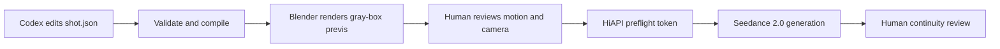

# Awesome Codex + Blender + Seedance Workflows

[简体中文](README.zh-CN.md) | [Setup](docs/setup.md) | [Architecture](docs/architecture.md) | [Research](docs/research.md) | [Roadmap](docs/PLAN.md)

Executable, reviewable workflows for turning a Codex-authored shot plan into a Blender gray-box previs and then into a Seedance 2.0 video through [HiAPI](https://www.hiapi.ai/).

This is not another prompt gallery. Every included workflow has a versioned JSON shot contract, deterministic compilation, a real Blender batch render, a dry-run-first HiAPI request, and tests.



## What ships

| Workflow | Control problem | Duration | Camera |
|---|---|---:|---|
| [Warehouse Pursuit](examples/warehouse-pursuit/shot.json) | Two-performer chase plus a crossing vehicle | 6s | Low handheld follow |
| [Rooftop Signal Reveal](examples/rooftop-reveal/shot.json) | Performance-to-scale reveal | 8s | Medium follow to crane wide |
| [Precision Watch Reveal](examples/tabletop-reveal/shot.json) | Product geometry and reflection timing | 5s | Macro slider arc |

The engine supports white-listed cubes, spheres, cylinders, cones, object transforms, camera transforms, focal-length changes, and linear keyframes. It deliberately does not execute arbitrary model-authored Python.

## Quick start

Requirements: Node.js 20+, Blender 4.5+ and FFmpeg. This repository was verified on Windows with Node 22.22.3, Blender 5.2.0 LTS, and FFmpeg 8.1.2.

```powershell
npm run doctor
npm test
npm run render -- examples/warehouse-pursuit/shot.json --out-dir outputs/warehouse-pursuit
```

Review `outputs/warehouse-pursuit/previs.mp4` from beginning to end. The proxies need to communicate the intended screen direction, timing, spacing, and camera path; they are not a visual target.

Compile and inspect the Seedance package:

```powershell
npm run compile -- examples/warehouse-pursuit/shot.json --out-dir build/warehouse-pursuit
npm run generate -- --request outputs/warehouse-pursuit/seedance.request.json --video outputs/warehouse-pursuit/previs.mp4
```

The last command is a dry run. It prints a payload summary and SHA-256 `preflightToken`, but it does not create a task. A paid request requires the exact token from the current request and video:

```powershell
npm run generate -- --request outputs/warehouse-pursuit/seedance.request.json --video outputs/warehouse-pursuit/previs.mp4 --confirm-preflight <token>
```

Create and manage an API key at the [HiAPI dashboard](https://www.hiapi.ai/en/dashboard/api-keys). Put it in the process environment as `HIAPI_API_KEY`; never put it in chat, source, a command argument, or Git. See [setup](docs/setup.md) for safe per-session examples.

## Use with Codex

Open this repository in Codex and give it a constrained shot brief:

```text
Read AGENTS.md. Copy the closest example into examples/subway-platform-reveal.
Create one continuous 7-second shot: a commuter notices an empty train arriving,
then the camera dollies sideways to reveal every carriage is dark. Keep screen
direction stable, use no more than six proxies, validate, compile, and render the
previs. Do not submit a paid HiAPI task.
```

`AGENTS.md` makes the review gates explicit. Blender MCP or [Blockout](https://github.com/wassermanproductions/blockout) can still be used for interactive exploration, but the final contribution must reduce to `shot.json` so it remains diffable and reproducible.

## Generated package

```text
outputs/<shot-id>/
|-- compiled.json
|-- manifest.json
|-- prompt.txt
|-- seedance.request.json
|-- previs.blend
|-- previs.mp4
|-- render-report.json
`-- frames/
```

Generated media and `.blend` files are ignored by Git. The manifest stores content hashes without embedding API keys or machine-specific paths.

## Design decisions

- **Previs is a control signal.** The compiled prompt tells Seedance to preserve blocking, timing, lens rhythm, and camera path while replacing every proxy surface.
- **One shot per spec.** Seedance references are strongest when a 4-15 second clip has one spatial and temporal contract.
- **No hidden paid action.** Submission is dry-run first; the confirmation token changes if the request or local video changes.
- **No arbitrary Blender code.** Schema validation and white-listed primitives keep Codex output auditable.
- **Interactive tools remain optional.** Blender MCP and Blockout are excellent authoring surfaces; this project is the lightweight, Git-native handoff layer.

## Human review checklist

Before paid generation: watch the whole previs, verify first/middle/last frames, confirm performer spacing, screen direction, contacts, camera speed, and requested duration.

After generation: review the whole clip for subject identity, limb/contact integrity, camera adherence, object count, continuity locks, unwanted proxy leakage, unsafe likeness/IP use, and audio sync. API `success` means generation completed; it does not mean the shot passed creative QC.

## Contributing

Start with [CONTRIBUTING.md](CONTRIBUTING.md). A workflow PR must include an original shot spec, a passing offline test run, a reviewed Blender previs, clear rights for any optional references, and no generated binaries or credentials.

MIT licensed. Research sources and non-code inspirations are recorded in [docs/research.md](docs/research.md); no third-party code or media is bundled.
